# FlowDesk – Enterprise Workflow Approval Portal

FlowDesk is a full-stack enterprise workflow automation platform built to streamline organizational approval processes through configurable workflows, role-based access control, and a dynamic approval engine.

The application enables employees to create requests, managers to review and approve them, and administrators to perform final approvals while maintaining a complete audit trail of every approval action.

Unlike traditional approval systems with hardcoded approval chains, FlowDesk introduces a **dynamic workflow engine** where administrators can configure approval steps without modifying application code.

This project demonstrates enterprise software engineering principles including layered architecture, reusable components, clean separation of concerns, scalable backend services, and production deployment.

---

# 🌐 Live Demo

### Frontend

https://enterprise-workflow-automation-chi.vercel.app/

### Backend

https://enterprise-workflow-automation.onrender.com

---

# 🔑 Demo Credentials

Use the following accounts to explore every module of the application.

| Role | Email | Password | Access |
|------|-------|----------|--------|
| Administrator | Sarv@gmail.com | Sarv@123 | Manage Users, Teams, Workflows and perform Final Approvals |
| Manager | Rish@gmail.com | Rish@123 | Create Requests and Approve assigned Requests |
| Employee | Temp@gmail.com | Temp@123 | Create, Edit, Submit and Track Requests |

> These accounts are provided only for demonstrating the application's complete workflow.

---

# 🚀 Suggested Walkthrough

To experience the complete request lifecycle, follow these steps.

## 1. Login as Administrator

Configure the organization.

- Create Users
- Create Teams
- Assign Managers
- Assign Administrators
- Configure Approval Workflows

---

## 2. Login as Employee

Create a request.

- Create Request
- Save as Draft
- Edit Draft
- Submit Request

---

## 3. Login as Manager

Review assigned requests.

- Open Approvals
- View Request Details
- Approve or Reject
- Add Mandatory Comments

---

## 4. Login as Administrator

Complete the workflow.

- Open Approvals
- Review Final Approval
- Approve Request
- Verify Approval History

This walkthrough demonstrates the complete lifecycle of a request from creation to final approval.

---

# 📸 Application Screenshots

The following screenshots showcase the primary modules of FlowDesk.

## Authentication

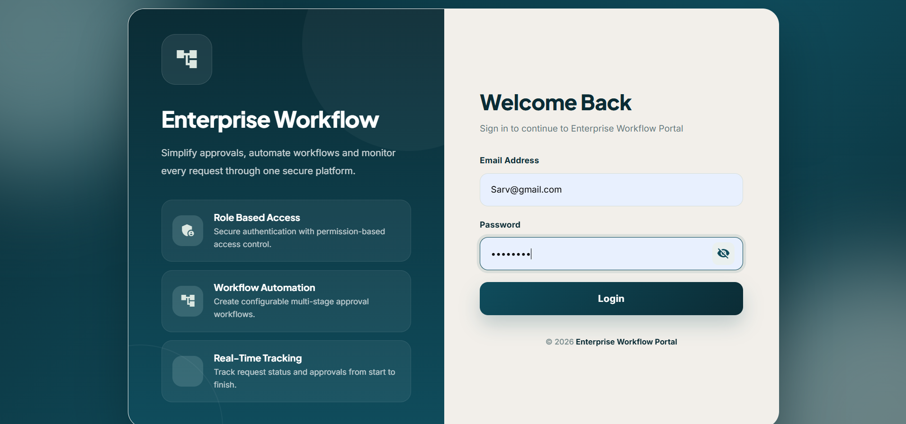

Secure JWT-based authentication with role-based login.

---

## Dashboard

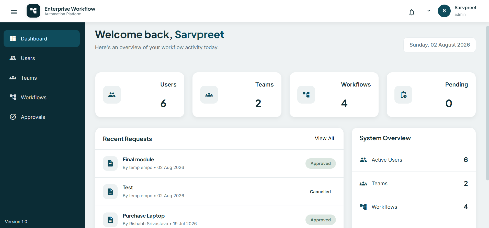

Role-aware dashboard displaying organization statistics and quick access to major modules.

---

## User & Team Management

| Users | Teams |
|:------:|:------:|
| 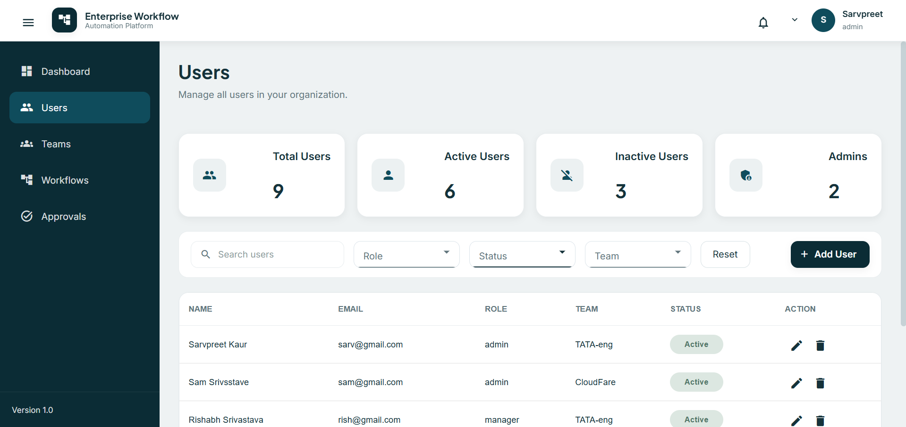 | 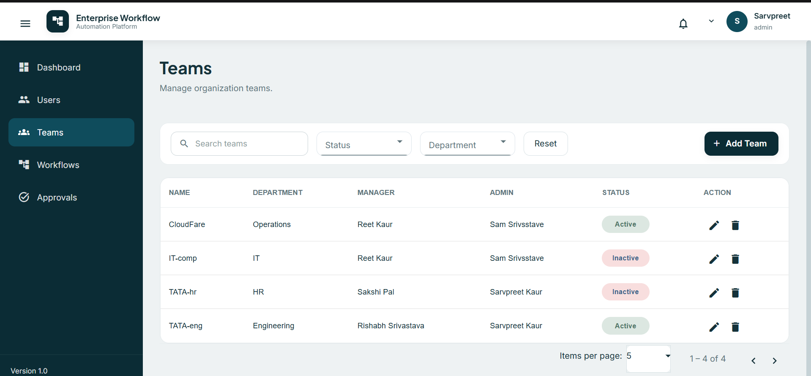 |

Manage organizational users, departments, managers, and teams.

---

## Workflow Management

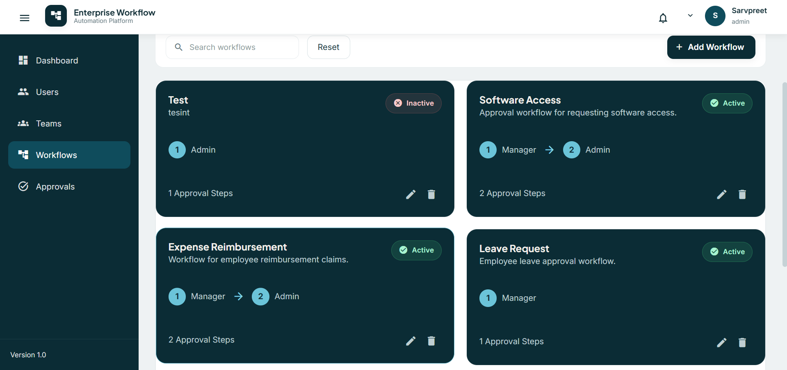

Create configurable approval workflows with multiple approval levels.

---

## Request Management

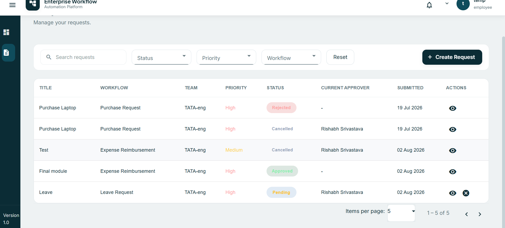

Manage requests through Draft, Pending, Approved, Rejected, and Cancelled states.

---

## Request Details

| Request Information | Approval History |
|:-------------------:|:----------------:|
| 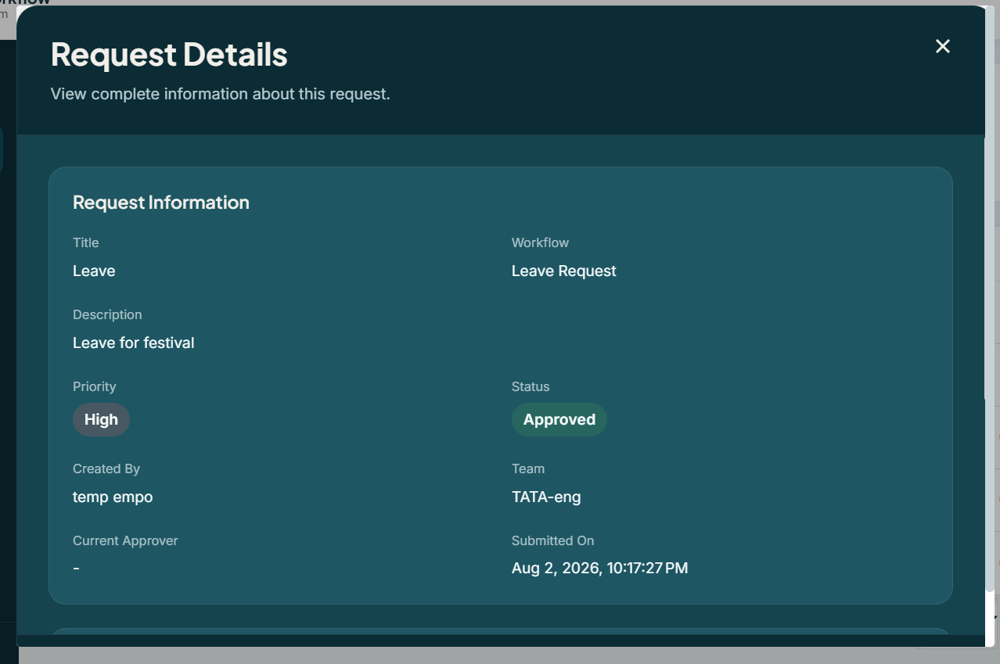 | 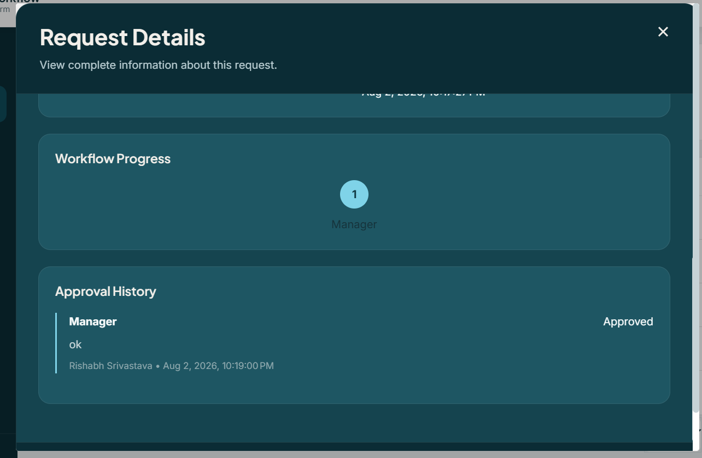 |

View complete request information including workflow progress and approval history.

---

## Pending Approvals

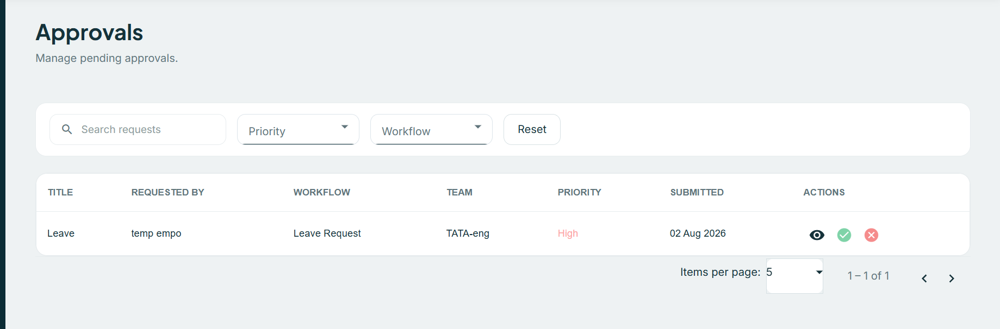

Managers and administrators can review, approve, or reject requests assigned to them.

---

# 📖 Project Overview

Organizations often rely on emails and spreadsheets for internal approvals, making processes difficult to monitor, audit, and scale.

FlowDesk replaces this fragmented workflow with a centralized approval platform that enables configurable workflows, dynamic approval routing, and role-based authorization.

Rather than embedding approval logic directly into code, workflows are stored in the database, allowing administrators to define new approval chains without requiring application changes.

The project emphasizes:

- Enterprise Architecture
- Modular Design
- Dynamic Workflow Configuration
- Separation of Concerns
- Reusable Components
- Service-Oriented Business Logic
- Production Deployment

---

# ✨ Key Features

## Authentication

- JWT Authentication
- Secure Login
- Route Guards
- HTTP Interceptors
- Persistent Sessions

---

## Dashboard

- Organization Statistics
- Role-Based Dashboard
- Quick Navigation
- Summary Cards

---

## User Management

- Create Users
- Update Users
- Activate / Deactivate Users
- Search
- Filters
- Pagination

---

## Team Management

- Create Teams
- Assign Managers
- Assign Administrators
- Department Mapping
- Search
- Filters
- Pagination

---

## Workflow Management

- Dynamic Workflow Builder
- Configurable Approval Steps
- Multi-Level Approval Chains
- Workflow Activation
- Workflow Editing
- Workflow Deletion

---

## Request Management

- Draft Requests
- Edit Drafts
- Submit Requests
- Cancel Pending Requests
- Request Details Dialog
- Workflow Progress Tracking
- Approval History
- Search
- Filters
- Pagination

---

## Approval Management

- Pending Approval Queue
- Approve Requests
- Reject Requests
- Mandatory Approval Comments
- Approval History
- Search
- Filters

---

# 🛠 Technology Stack

## Frontend

- Angular 21
- Angular Material
- TypeScript
- RxJS
- Reactive Forms
- Standalone Components

---

## Backend

- Node.js
- Express.js
- MongoDB
- Mongoose
- JWT Authentication

---

## Deployment

- Vercel
- Render
- MongoDB Atlas

---

# 🎯 Design Goals

FlowDesk was designed to simulate how modern enterprise workflow systems are built.

The primary design goals were:

- Configurable approval workflows
- Dynamic approver resolution
- Layered architecture
- Reusable Angular components
- Service-oriented backend design
- Role-based authorization
- Responsive enterprise interface
- Clean separation between presentation, business logic, and persistence

---

# 🏗 System Architecture

FlowDesk follows a layered architecture where every layer has a clearly defined responsibility.

```
                    Angular Frontend
                           │
                           ▼
                    Angular Services
                           │
                           ▼
                  Express Controllers
                           │
                           ▼
                  Business Services
                           │
                           ▼
                     MongoDB Models
                           │
                           ▼
                     MongoDB Atlas
```

The application separates presentation, business logic, and data persistence, resulting in a modular and maintainable codebase.

---

## Overall System Architecture

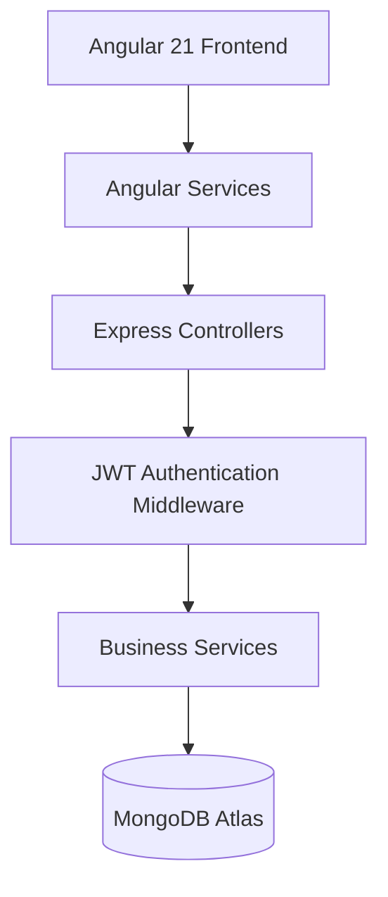

---

## Presentation Layer

The Presentation Layer is responsible for rendering the user interface and interacting with backend services.

Built using:

- Angular Standalone Components
- Angular Material
- Reactive Forms
- RxJS
- Signals

Responsibilities include:

- User Interaction
- Form Validation
- Dialog Management
- Routing
- API Integration
- Displaying Dynamic Data

---

## Service Layer

Angular services act as the communication bridge between UI components and backend APIs.

Responsibilities include:

- HTTP Communication
- Authentication
- State Management
- Error Handling
- Request Transformation
- Response Processing

Every feature module has its own dedicated service to keep responsibilities isolated.

---

## Controller Layer

Controllers remain intentionally lightweight.

Responsibilities:

- Receive HTTP Requests
- Validate Input
- Invoke Business Services
- Return Responses

No business rules are implemented inside controllers.

---

## Business Service Layer

The Business Service Layer contains all enterprise business rules.

Examples include:

- Workflow Validation
- Request Submission Logic
- Team Validation
- Role Authorization
- Approval Resolution
- Approval History Management
- Workflow Progression

Keeping business logic inside services improves maintainability, readability, and testability.

---

## Data Layer

MongoDB stores all persistent application data.

Collections include:

- Users
- Teams
- Workflows
- Requests

Relationships between collections are managed using Mongoose references and population.

---

# ⚙ Dynamic Workflow Engine

Traditional approval systems often hardcode approval chains.

FlowDesk instead implements a **dynamic workflow engine** where approval steps are stored as data rather than application logic.

Administrators can configure workflows without modifying code.

Example:

```
Purchase Request

↓

Manager Approval

↓

Administrator Approval
```

Another workflow may simply be:

```
Leave Request

↓

Manager Approval
```

Each workflow stores:

- Workflow Name
- Description
- Active Status
- Approval Steps
- Step Order
- Approver Role
- Rejection Capability

Because workflows are database-driven, new business processes can be introduced without changing backend logic.

---

## Workflow Engine Architecture

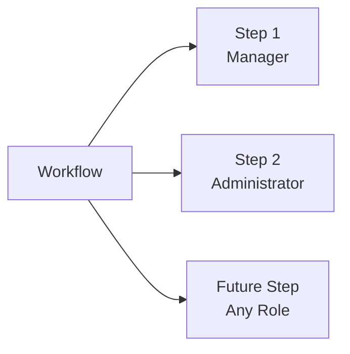

This demonstrates that approval flows are configurable and scalable rather than hardcoded.

---

# 🔄 Approval Engine

FlowDesk implements a sequential approval engine that automatically routes requests to the correct approver.

When a request is submitted:

1. The selected workflow is loaded.
2. The requester's role is evaluated.
3. The first applicable approver is resolved.
4. The request is assigned to that approver.
5. Each approval advances the request to the next configured workflow step.
6. Once all steps are completed, the request is automatically approved.

The approval engine is completely generic and works with workflows containing any number of approval stages.

---

## Approval Engine Flow

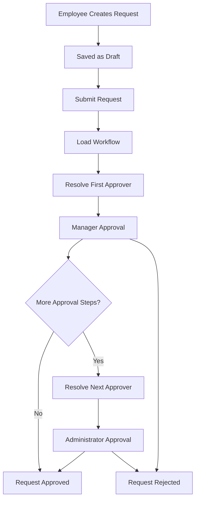

This design allows the approval process to adapt automatically to different workflow configurations.

---

# 🎯 Dynamic Approver Resolution

Approvers are never hardcoded.

Instead, the system determines the next approver dynamically using:

- Current Workflow
- Current Approval Step
- Requester's Role
- Assigned Team
- Team Manager
- Team Administrator

This ensures the same approval engine can support multiple workflow configurations without code duplication.

---

# 👥 Role-Based Access Control

Authentication is handled using JWT tokens while authorization is enforced through role-based middleware.

Three organizational roles are supported.

---

## Employee

Employees can:

- Create Requests
- Edit Draft Requests
- Submit Requests
- Cancel Pending Requests
- View Their Own Requests

Employees cannot:

- Approve Requests
- Manage Users
- Manage Teams
- Configure Workflows

---

## Manager

Managers inherit all Employee permissions.

Additional capabilities include:

- View Assigned Approvals
- Approve Requests
- Reject Requests
- Add Mandatory Approval Comments

Managers can only approve requests assigned to them.

---

## Administrator

Administrators are responsible for managing the organization.

Capabilities include:

- User Management
- Team Management
- Workflow Configuration
- Final Approval Authority
- View Organizational Data

Administrators do not create requests.

---

## Role Access Overview

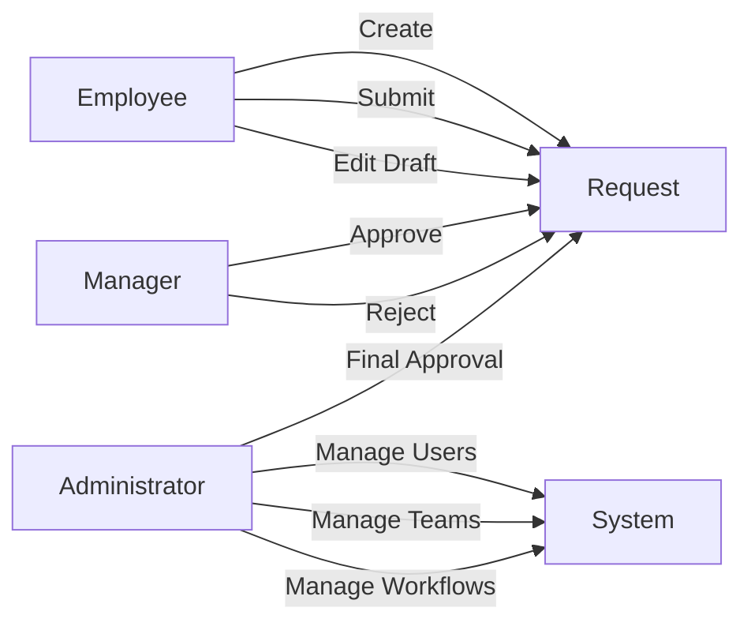

---

# 📄 Request Lifecycle

Every request moves through a predefined lifecycle.

```
Draft

↓

Pending

↓

Approval Engine

↓

Approved
```

Alternative outcomes:

```
Pending

↓

Rejected
```

or

```
Pending

↓

Cancelled
```

Business rules enforced by the application include:

- Only Draft requests can be edited.
- Only Pending requests can be approved.
- Only Pending requests can be cancelled.
- Completed requests become immutable.

---

## Request Lifecycle Diagram

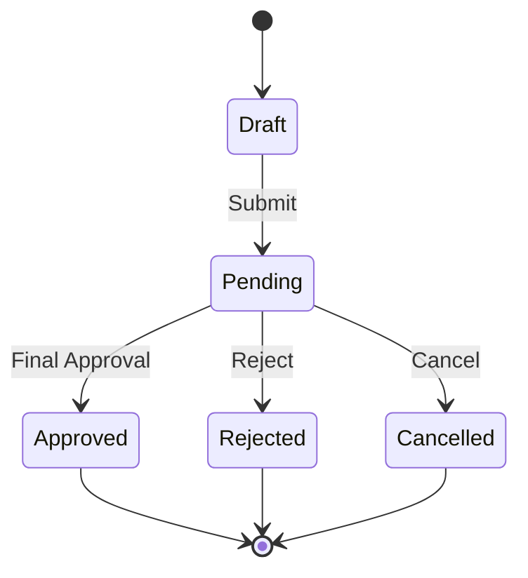

---

# ✅ Validation Strategy

Validation is implemented across multiple layers to ensure data integrity and enforce business rules.

## Frontend Validation

Angular Reactive Forms provide:

- Required Field Validation
- Conditional Validation
- Dynamic Form Validation
- Real-Time Error Messages
- Form State Management

---

## Backend Validation

Business validations include:

- JWT Authentication
- Role Authorization
- Workflow Existence Validation
- Team Assignment Validation
- Request Ownership Validation
- Approval Permission Validation
- Request Status Validation
- Workflow Integrity Checks

This layered validation ensures that invalid operations cannot bypass the frontend by directly accessing backend APIs.

---

# 🏛 Enterprise Design Principles

FlowDesk was developed by following enterprise software engineering principles to ensure scalability, maintainability, and clean architecture.

---

## Separation of Concerns

Each layer of the application has a dedicated responsibility.

- Components manage presentation logic.
- Angular Services handle API communication.
- Controllers process HTTP requests.
- Business Services contain application logic.
- Models manage data persistence.

This separation reduces coupling and makes each layer easier to maintain.

---

## Modular Feature Architecture

The application is divided into independent feature modules.

Major modules include:

- Authentication
- Dashboard
- Users
- Teams
- Workflows
- Requests
- Approvals

Each module encapsulates its own components, services, routing, and business logic.

This modular architecture improves scalability and maintainability.

---

## Reusable Components

Common functionality has been extracted into reusable components across the application.

Examples include:

- Filter Bar
- Empty State
- Dashboard Cards
- Confirmation Dialogs
- Alert Service
- Request Dialog
- Workflow Builder

This reduces duplication and keeps the user interface consistent.

---

## Service-Oriented Business Logic

Business rules are centralized inside dedicated service classes rather than controllers.

Benefits include:

- Better code organization
- Easier maintenance
- Improved readability
- Simplified testing
- Reusable business logic

Controllers remain lightweight and focus only on coordinating requests and responses.

---

## Dynamic Business Rules

Instead of embedding workflow rules into code, FlowDesk stores workflow definitions inside MongoDB.

This allows administrators to:

- Create workflows
- Modify approval sequences
- Activate or deactivate workflows

without requiring application changes.

---

## Responsive Enterprise Experience

The interface was designed to resemble modern enterprise management systems.

Design goals included:

- Professional dashboard layout
- Dark-themed interface
- Consistent spacing
- Responsive design
- Minimal visual clutter
- Accessible typography
- Reusable dialogs

---

# 🔒 Security

FlowDesk incorporates multiple security practices commonly used in enterprise applications.

Implemented features include:

- JWT Authentication
- Password Hashing using bcrypt
- Protected API Routes
- Route Guards
- HTTP Interceptors
- Role-Based Authorization
- Middleware-Based Permission Checks
- Secure Environment Variables

Authorization is enforced on both the frontend and backend to ensure secure access regardless of client behavior.

---

# 🚀 Deployment

The application has been successfully deployed using cloud platforms.

| Component | Platform |
|-----------|----------|
| Frontend | Vercel |
| Backend | Render |
| Database | MongoDB Atlas |

Deployment included:

- Production Angular Build
- Backend Deployment
- Environment Variable Configuration
- MongoDB Atlas Integration
- Production API Configuration
- CORS Configuration

---

# 💡 Challenges & Learnings

Developing FlowDesk involved solving several real-world engineering challenges.

### Dynamic Workflow Engine

Instead of hardcoding approval paths, workflows were modeled as configurable database entities, allowing new approval chains to be introduced without modifying application logic.

---

### Generic Approval Engine

A reusable approval engine was implemented to dynamically determine the next approver based on:

- Workflow configuration
- Current approval step
- Assigned team
- User role

This enables workflows of varying lengths while keeping the implementation generic.

---

### Role-Based Authorization

Different application behavior was implemented for Employees, Managers, and Administrators while ensuring consistent authorization across frontend and backend.

---

### Modular Angular Architecture

The frontend was organized into independent feature modules with reusable services and shared components, improving maintainability and reducing duplication.

---

### Production Deployment

Deploying a full-stack application introduced several practical challenges, including:

- Environment variable management
- Production build optimization
- CORS configuration
- Case-sensitive imports
- Deployment troubleshooting on Render and Vercel

These experiences provided valuable insight into deploying production-ready web applications.

---

# 🔮 Future Enhancements

Potential future improvements include:

- Email Notifications
- File Attachments
- Real-Time Notifications using WebSockets
- Dashboard Analytics
- Workflow Templates
- Audit Logs
- Activity Timeline
- Bulk Operations
- Multi-Tenant Support
- Notification Center
- Export Reports
- Fine-Grained Permission Management

---

# ⚙ Local Setup

## Clone Repository

```bash
git clone https://github.com/Sarvpreet-Kaur/Enterprise_Workflow_Automation.git
```

---

## Backend

```bash
cd backend

npm install

npm run dev
```

---

## Frontend

```bash
cd frontend

npm install

ng serve
```

The frontend will be available at:

```
http://localhost:4200
```

---

# 🌱 Environment Variables

Create a `.env` file inside the backend directory.

```env
PORT=5000

MONGO_URI=your_mongodb_connection_string

JWT_SECRET=your_jwt_secret
```

---

# ⭐ Project Highlights

FlowDesk demonstrates several enterprise software engineering concepts:

- Enterprise Workflow Automation
- Dynamic Workflow Configuration
- Multi-Level Approval Engine
- Layered Architecture
- Modular Feature Design
- Role-Based Access Control
- JWT Authentication
- Angular Standalone Components
- Angular Material
- Reactive Forms
- RESTful API Development
- MongoDB Integration
- Production Deployment
- Reusable UI Components
- Clean Separation of Concerns
- Service-Oriented Business Logic

---

# 📚 What I Learned

Building FlowDesk provided hands-on experience with:

- Designing enterprise application architecture
- Implementing configurable workflow systems
- Building a dynamic approval engine
- Managing complex role-based authorization
- Structuring scalable Angular applications
- Organizing backend business logic using service layers
- Deploying full-stack applications to cloud platforms
- Integrating Angular, Express, and MongoDB into a production-ready solution

---

# 🙏 Acknowledgements

FlowDesk was developed as a learning and portfolio project to understand how enterprise workflow management systems are designed and implemented using modern web technologies.

The project combines frontend engineering, backend architecture, authentication, authorization, workflow automation, and cloud deployment into a complete end-to-end application.

---

# 👩‍💻 Author

**Sarvpreet Kaur**

Software Developer Trainee - Gemini Solutions Pvt. Ltd

B.Tech – Computer Science (AI & ML) - 2027

**GitHub**

https://github.com/Sarvpreet-Kaur

**LinkedIn**

https://www.linkedin.com/in/sarvpreet-kaur-a230702a1/

---

# 📄 License

This project is intended for educational, learning, and portfolio purposes.

Feel free to explore the codebase, provide feedback, or use it as a reference for learning enterprise application architecture.
